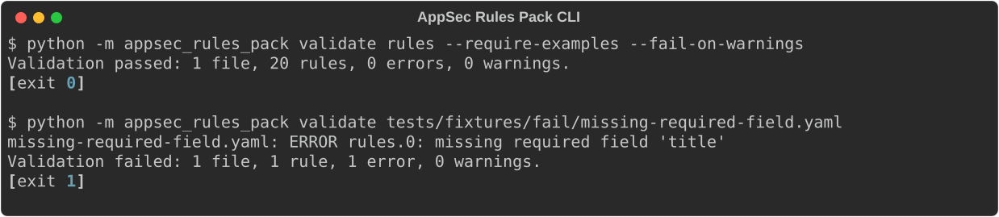

# AppSec Rules Pack

[](https://github.com/lucashgrifoni/AppSec-Rules-Pack/actions/workflows/ci.yml)
[](https://github.com/lucashgrifoni/AppSec-Rules-Pack/actions/workflows/security-ci-cd.yml)
[](https://scorecard.dev/viewer/?uri=github.com/lucashgrifoni/AppSec-Rules-Pack)
[](https://github.com/lucashgrifoni/AppSec-Rules-Pack/blob/master/LICENSE)
[](https://github.com/lucashgrifoni/AppSec-Rules-Pack/blob/master/pyproject.toml)
[](https://pypi.org/project/appsec-rules-pack/)

Reusable AppSec policy-as-code rules for secure application review, CI quality gates,
and manual evidence collection.

This initial pack is intentionally generic. It does not contain product names,
tenant identifiers, customer data, secrets, internal endpoints, or environment-specific
configuration.

## Why / When not to use

Use this rule contract and engine-agnostic validator to keep AppSec review guidance,
expected evidence, remediation, and exceptions consistent across teams and CI gates.
It validates the structure and consistency of rule packs.

It does not execute rules or scan application code. Use a separate scanner when you need
vulnerability findings. Framework mappings support review; they do not establish
compliance. The derived Semgrep scaffold has placeholder patterns, and the SARIF catalog
has no findings. See [the scope](TECHNICAL_SPEC.md) and
[ADR-0001](docs/adr/0001-engine-agnostic-validator.md).



The demo records real CLI output. [Recreate it](docs/assets/record-cli-demo.py) from a
source checkout with `python docs/assets/record-cli-demo.py` after installing the project.

## What Is Included

- A short technical specification in `TECHNICAL_SPEC.md` and a direction summary in
  `ROADMAP.md`.
- A JSON Schema rule contract in `src/appsec_rules_pack/schemas/appsec-rule.schema.json`.
- A baseline YAML rules pack of 19 generic rules in `rules/appsec-baseline.yaml`,
  covering authentication, authorization, input validation, injection (including
  output-encoding/XSS), SSRF, secrets, file handling, logging, dependency risk,
  configuration, session hardening, CSRF, webhook/message integrity, excessive data
  exposure, mass assignment, open redirect, and rate limiting. Every rule ships an
  explicit compliant and violating code example.
- A Python 3.12+ validator with a Typer CLI supporting `--version`,
  `--fail-on-warnings`, `--require-examples`, and `--format json` output for CI, plus
  derivation-only `export index`, `export semgrep`, `export sarif`, and `report coverage`
  subcommands.
- Derived, drift-tested artifacts under `exports/`: a machine-readable rule index
  (`appsec-baseline.index.json`), a clearly labeled NON-runnable Semgrep scaffold, and a
  SARIF 2.1.0 rule catalog (empty results). Derivation only — the validator stays
  engine-agnostic and never executes rules (ADR-0001).
- Unit tests and pass/fail/warn fixtures for valid packs, invalid schema shape,
  enum/type/additionalProperties failures, duplicate rule IDs, cross-file
  duplicate IDs, exception-window warnings, exception-policy contradictions,
  malformed framework mapping IDs, and sensitive-value detection.
- A 95% coverage gate plus a hardened CI/CD surface: a build/lint/test workflow (with
  separate jobs running the suite on Ubuntu and Windows, and on Python 3.13), a security
  pipeline (Semgrep, CodeQL, Bandit, Trivy, KICS, pip-audit, Gitleaks, Dependency Review,
  actionlint), and OpenSSF Scorecard analysis. The build/lint/test, cross-platform, and
  security jobs are required status checks on `master`.
- Architecture decision records in [`docs/adr/`](https://github.com/lucashgrifoni/AppSec-Rules-Pack/blob/master/docs/adr/README.md), including the two that
  define this project's boundary: the validator stays engine-agnostic (ADR-0001) and the CI
  gate consumes its JSON rather than embedding enforcement (ADR-0004).
- Contribution guidance for safe rule additions, a code of conduct, and issue/PR
  templates.
- A CI integration template in `examples/`.

## Project Layout

```text
.
|-- .github/
|   |-- ISSUE_TEMPLATE/     # bug reports, rule proposals, and template configuration
|   |-- workflows/         # CI, security, policy gate, Scorecard, and publishing
|   |-- CODEOWNERS
|   |-- PULL_REQUEST_TEMPLATE.md
|   `-- dependabot.yml
|-- docs/
|   |-- adr/               # architecture decision records
|   `-- assets/            # recorded CLI demo and its reproduction script
|-- examples/
|   `-- README.md          # GitHub Actions integration example
|-- exports/
|   |-- appsec-baseline.index.json
|   |-- sarif/appsec-baseline.sarif.json
|   `-- semgrep/appsec-baseline.semgrep.yaml
|-- rules/appsec-baseline.yaml
|-- src/appsec_rules_pack/
|   |-- __init__.py
|   |-- __main__.py
|   |-- cli.py
|   |-- exporter.py
|   |-- loader.py
|   |-- reporter.py
|   |-- sarif_export.py
|   |-- semgrep_scaffold.py
|   |-- validator.py
|   `-- schemas/appsec-rule.schema.json
|-- tests/
|   |-- fixtures/          # valid, invalid, warning, and multi-file packs
|   |-- helpers.py
|   `-- test_*.py
|-- CHANGELOG.md
|-- CODE_OF_CONDUCT.md
|-- CONTRIBUTING.md
|-- LICENSE
|-- README.md
|-- ROADMAP.md
|-- SECURITY.md
|-- STATUS.md
|-- TECHNICAL_SPEC.md
`-- pyproject.toml
```

## Installation

Install the published package from PyPI:

```bash
pip install appsec-rules-pack
```

This installs the `appsec-rules` console script. Pin to a reviewed version
(for example `appsec-rules-pack==0.4.0`) when using it in a CI quality gate.

**What the distribution contains:** the validator, the CLI, and the JSON Schema. It does
not ship a rules pack — the CLI validates whatever path you point it at.

To get the baseline pack of 19 rules, either take the version-pinned copy attached to each
GitHub Release:

```bash
curl -LO https://github.com/lucashgrifoni/AppSec-Rules-Pack/releases/download/v0.4.0/appsec-baseline.yaml
```

or copy [`rules/appsec-baseline.yaml`](https://github.com/lucashgrifoni/AppSec-Rules-Pack/blob/master/rules/appsec-baseline.yaml) from this repository.
You can also write your own pack from the example below.

### Verify a release

After downloading a release asset, verify its SLSA build-provenance attestation with a
current [GitHub CLI](https://cli.github.com/manual/gh_attestation_verify):

```bash
gh attestation verify appsec-baseline.yaml --repo lucashgrifoni/AppSec-Rules-Pack
```

For a tighter check, also require the publishing workflow and the release tag you chose:

```bash
gh attestation verify appsec-baseline.yaml \
  --repo lucashgrifoni/AppSec-Rules-Pack \
  --signer-workflow lucashgrifoni/AppSec-Rules-Pack/.github/workflows/publish-pypi.yml \
  --source-ref refs/tags/v0.4.0
```

From v0.4.0 each Release also carries the signed provenance bundle as
`appsec-rules-pack-<tag>.intoto.jsonl`, so the check also works without querying the
attestation API:

```bash
gh attestation verify appsec-baseline.yaml \
  --repo lucashgrifoni/AppSec-Rules-Pack \
  --bundle appsec-rules-pack-v0.4.0.intoto.jsonl
```

Use the same command with a downloaded wheel, source distribution, or `sbom.cdx.json`.
The [publishing workflow](.github/workflows/publish-pypi.yml) attests those files and the
baseline pack; [ADR-0003](docs/adr/0003-release-provenance.md) explains the release design.
A successful check verifies the artifact against its signed provenance and the selected
identity constraints. It does not certify that the rule guidance is complete or that an
application is secure. Treat a failed or unavailable verification as unverified provenance.

### From source (development)

```powershell
python -m venv .venv
.\.venv\Scripts\python -m pip install -e ".[dev]"
```

On macOS/Linux:

```bash
python -m venv .venv
.venv/bin/python -m pip install -e ".[dev]"
```

If the dependencies already exist in the active Python environment, the validator can
also be run directly with `PYTHONPATH=src`.

## Your First Rules Pack

A pack is a `pack` block plus one or more `rules`. This is a complete, valid minimal pack —
copy it, run `appsec-rules validate` on it, then grow it. Every field shown is required; the
full contract is in
[`appsec-rule.schema.json`](https://github.com/lucashgrifoni/AppSec-Rules-Pack/blob/master/src/appsec_rules_pack/schemas/appsec-rule.schema.json), and the
19 baseline rules in [`rules/appsec-baseline.yaml`](https://github.com/lucashgrifoni/AppSec-Rules-Pack/blob/master/rules/appsec-baseline.yaml) are worked
examples.

<!-- readme-example:minimal-pack (validated by tests/test_readme_example.py) -->

```yaml
pack:
  id: my-pack
  name: My Rules Pack
  version: 0.1.0
  mode: advisory
  owner: appsec
  description: A minimal rules pack to start from.

rules:
  - id: APPSEC-EXAMPLE-001
    title: Require controlled error handling
    description: Verify that invalid user input returns controlled errors without stack traces.
    severity: medium
    category: configuration
    status: enabled
    enforcement: advisory
    targets:
      - api
    mappings:
      owasp_asvs:
        - V14.4
      owasp_api_top_10_2023:
        - API8:2023
      cwe:
        - CWE-209
      nist_ssdf:
        - PW.7
    evidence:
      required:
        - Error handling path returns a documented response shape.
      signals:
        - Negative tests assert controlled error messages for invalid input.
    match:
      type: review
      includes:
        - API handlers that process untrusted input.
      excludes:
        - Local developer-only scripts that are not shipped.
    remediation:
      guidance: Replace raw exception output with a controlled error contract.
      validation:
        - Run negative tests for invalid input and malformed requests.
    exceptions:
      allowed: true
      max_days: 30
      required_fields:
        - owner
        - justification
        - expires_at
```

Note the shapes that are easy to guess wrong: `evidence` and `match` are objects (not
lists), `remediation` needs `guidance`, and `required_fields` accepts only `owner`,
`justification`, `expires_at`, `compensating_control`, and `validation_plan`.

## Usage

The examples below use `rules/appsec-baseline.yaml`, which exists in **this repository**.
If you installed from PyPI, point the CLI at your own rules file or directory instead.

Validate the baseline rules pack:

```bash
python -m appsec_rules_pack validate rules/appsec-baseline.yaml
```

Validate every `.yaml` or `.yml` rules pack under a directory:

```bash
python -m appsec_rules_pack validate rules
```

Or, after installation, use the console script:

```bash
appsec-rules validate rules/appsec-baseline.yaml
```

Fail on warnings as well as errors:

```bash
appsec-rules validate rules/appsec-baseline.yaml --fail-on-warnings
```

Warn when an enabled rule ships no compliant/violating examples (opt-in):

```bash
appsec-rules validate rules --require-examples
```

Emit machine-readable JSON for CI pipelines:

```bash
appsec-rules validate rules --format json
```

Show the installed version:

```bash
appsec-rules --version
```

Derive a machine-readable rule index (JSON) for downstream tooling. This only reads
and derives pack metadata; it does not execute rules or emit findings:

```bash
appsec-rules export index rules/appsec-baseline.yaml
appsec-rules export index rules/appsec-baseline.yaml --output exports/appsec-baseline.index.json
```

Derive the non-executable Semgrep scaffold. It contains rule metadata and
`TODO-REPLACE-WITH-DETECTION-PATTERN` placeholders, not detection logic:

```bash
appsec-rules export semgrep rules/appsec-baseline.yaml --output exports/semgrep/appsec-baseline.semgrep.yaml
```

Derive a SARIF 2.1.0 rule catalog. Its `tool.driver.rules` describes the rules, and its
`results` array is empty because no scanner ran:

```bash
appsec-rules export sarif rules/appsec-baseline.yaml --output exports/sarif/appsec-baseline.sarif.json
```

Report how many rules have a mapping for each framework, plus missing rule IDs and
counts by AppSec category. This is mapping coverage, not security-test or compliance coverage:

```bash
appsec-rules report coverage rules/appsec-baseline.yaml
appsec-rules report coverage rules/appsec-baseline.yaml --format json --output coverage.json
```

Export and coverage commands derive metadata without running the validator first. Run
`validate rules --require-examples --fail-on-warnings` separately as the quality gate.

The JSON **validation** report (`validate --format json`) contains a `summary` object
(`files`, `rules`, `errors`, `warnings`, `ok`) and a `files` array with per-file issues
(`level`, `path`, `message`). Validation exits non-zero on errors or on warnings when
`--fail-on-warnings` is set, matching the text output.

## Use It In Your CI

`examples/README.md` contains a GitHub Actions template for installing the pack from
PyPI, validating a rules directory, and failing the build on errors (and optionally
warnings). Pin the install to a reviewed release version before enabling it as a
quality gate.

## Rule Pack Model

Rules are advisory by default. Each rule defines:

- a stable ID and severity;
- the target surface and AppSec category;
- framework mappings such as OWASP ASVS 5.0, OWASP API Security Top 10, OWASP Top 10:2025
  (optional), CWE, and NIST SSDF;
- expected evidence and review signals;
- match guidance for reviewers or automation;
- remediation and validation guidance;
- exception metadata requirements;
- a compliant and a violating code example with a short explanation.

The initial version is optimized for reviewability and deterministic validation, not for
deep scanner-specific matching.

## Validation

```bash
python -m pytest
PYTHONPATH=src python -m appsec_rules_pack validate rules
```

The validator checks JSON Schema compliance, duplicate rule IDs within a file and across
a validated directory, exception-window limits, exception-policy contradictions
(for example, a disallowed exception that still declares a window), malformed framework
mapping identifiers (CWE, OWASP API Top 10 2023, OWASP ASVS, NIST SSDF), and basic
sensitive-value patterns. Directory validation reports each issue with the relative file
path, schema path, severity, and a concise remediation-oriented message.

## Contributing

See `CONTRIBUTING.md` for rule authoring principles, the severity model, exception
requirements, and the required checks. All participation is governed by
`CODE_OF_CONDUCT.md`. To report a security issue, follow `SECURITY.md`.

## License

Licensed under the Apache License 2.0. See `LICENSE`.

## Optional executable Semgrep references

The hand-maintained [Semgrep reference layer](exports/semgrep-rules/README.md)
contains two tested Python/Flask detections:

- `APPSEC-INJECT-001`: Flask query/form values reaching locally established sqlite3
  SQL arguments; parameterized values are negative fixtures
- `APPSEC-SSRF-001`: Flask query/form values reaching module-level Requests URL
  arguments; fixed destination URLs are negative fixtures

The other 17 baseline rule IDs have no executable detection. Even these two detections
cover only their documented source/sink combinations, with known false positives and
false negatives. They do not establish complete coverage of SQL injection or SSRF.
See the layer README for the full coverage inventory and limitations.

Install Semgrep separately and run the fixture suite from a source checkout:

```bash
python -m pip install "semgrep==1.179.0"
semgrep --test --strict --metrics=off --config exports/semgrep-rules/rules exports/semgrep-rules/tests
```

To scan your own Python source, point that separately installed engine at the
reference rules and your source directory. The `appsec-rules` CLI does not invoke
Semgrep, and `export semgrep` continues to emit the non-executable metadata scaffold.
[ADR-0005](docs/adr/0005-executable-semgrep-subset.md) records this boundary.
